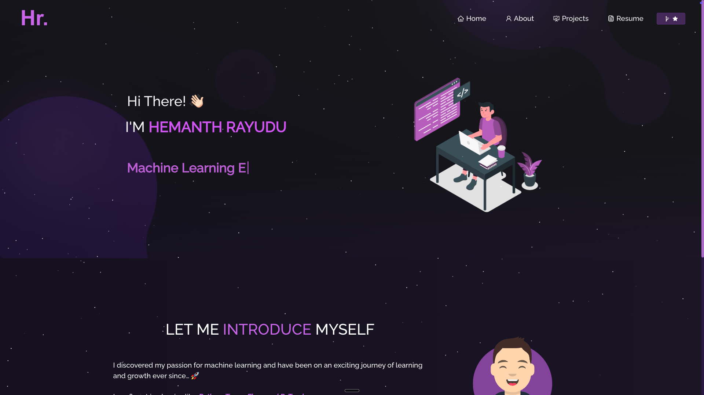

# Hemanth Rayudu - Portfolio

## 🚀 [Live Demo](https://hemanthrayudu.vercel.app/)

A modern, responsive portfolio website showcasing my expertise in Machine Learning, AI, and Software Engineering.

<div align="center">
  
</div>

## 🛠️ Built With

- **Frontend**: React.js, Bootstrap
- **Styling**: CSS3, React-Bootstrap
- **Deployment**: Vercel
- **Version Control**: Git & GitHub
- **IDE**: VS Code

## 🎯 Key Features

- **Modern UI/UX**: Clean, professional design with smooth animations
- **Responsive Design**: Optimized for all devices (desktop, tablet, mobile)
- **Project Showcase**: 
  - Spotify Podcast Recommendation System
  - SQL-LLM Comparison Tool
  - Face Detection with Deep Learning
- **Interactive Elements**: Dynamic typing animations, particle effects
- **Professional Resume**: Downloadable PDF format
- **Social Links**: Direct connections to GitHub, LinkedIn, Twitter

## 💻 Core Technologies & Skills

### Machine Learning & AI
- Deep Learning
- Natural Language Processing
- Computer Vision
- LLM Fine-tuning
- Prompt Engineering

### Programming & Tools
- Python
- TensorFlow
- PyTorch
- React.js
- Node.js
- SQL

## 🚀 Getting Started

1. **Clone the repository**
   ```bash
   git clone https://github.com/hemanthrayuduu/Portfolio.git
   ```

2. **Install dependencies**
   ```bash
   cd Portfolio
   npm install
   ```

3. **Run development server**
   ```bash
   npm start
   ```
   Open [http://localhost:3000](http://localhost:3000) to view it in your browser.

## 📂 Project Structure

```
Portfolio/
├── src/
│   ├── components/     # React components
│   ├── Assets/        # Images and static files
│   ├── style.css      # Global styles
│   └── App.js         # Main application
├── public/            # Public assets
└── package.json       # Project dependencies
```

## 🔧 Customization

1. Update personal information in `src/components/Home/`
2. Modify projects in `src/components/Projects/`
3. Edit skills in `src/components/About/`
4. Update resume in `src/Assets/`

## 📫 Contact

- LinkedIn: [Hemanth Rayudu](https://www.linkedin.com/in/hemanthrayudu/)
- GitHub: [@hemanthrayuduu](https://github.com/hemanthrayuduu)
- Twitter: [@HemanthRayudu14](https://twitter.com/HemanthRayudu14)

## 📄 License

This project is open source and available under the MIT License.

---

<div align="center">
  <p>If you found this project helpful, please consider giving it a ⭐!</p>
  
  [](https://github.com/hemanthrayuduu/Portfolio/stargazers)
</div>

<h2 align="center">
  Portfolio Website - v2.0<br/>
  <a href="https://Hemanth Rayudu.vercel.app/" target="_blank">Hemanth Rayudu.tech</a>
</h2>

<br/>

<center>

[](https://forthebadge.com) &nbsp;
[](https://forthebadge.com) &nbsp;
[](https://forthebadge.com) &nbsp;
 &nbsp;


</center>

<h3 align="center">
    🔹
    <a href="https://github.com/hemanthrayuduu/Portfolio/issues">Report Bug</a> &nbsp; &nbsp;
    🔹
    <a href="https://github.com/hemanthrayuduu/Portfolio/issues">Request Feature</a>
</h3>

## TL;DR

You can fork this repo to modify and make changes of your own. Please give me proper credit by linking back to [hemanthrayuduu](https://github.com/hemanthrayuduu/Portfolio). Thanks!

## Built With

My personal portfolio <a href="https://hemanthrayudu.vercel.app/" target="_blank">Hemanth Rayudu.tech</a> which features some of my github projects as well as my resume and technical skills.<br/>

This project was built using these technologies.

- React.js
- Node.js
- Express.js
- CSS3
- VsCode
- Vercel

## Features

**📖 Multi-Page Layout**

**🎨 Styled with React-Bootstrap and Css with easy to customize colors**

**📱 Fully Responsive**

## Getting Started

Clone down this repository. You will need `node.js` and `git` installed globally on your machine.

## 🛠 Installation and Setup Instructions

1. Installation: `npm install`

2. In the project directory, you can run: `npm start`

Runs the app in the development mode.\
Open [http://localhost:3000](http://localhost:3000) to view it in the browser.
The page will reload if you make edits.

## Usage Instructions

Open the project folder and Navigate to `/src/components/`. <br/>
You will find all the components used and you can edit your information accordingly.


